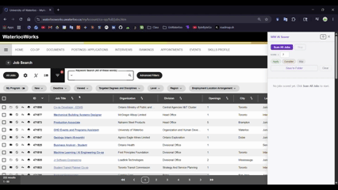
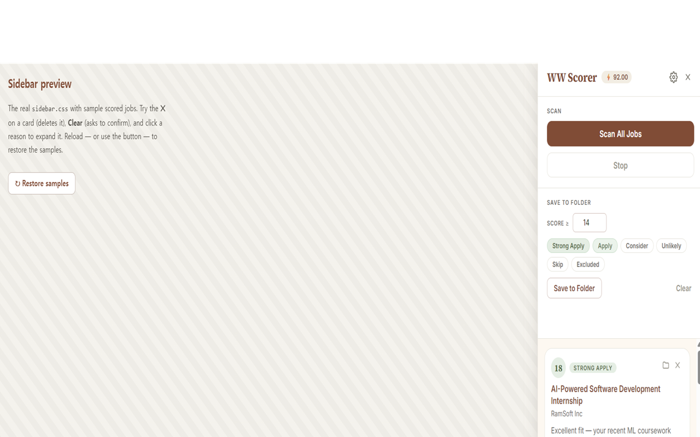
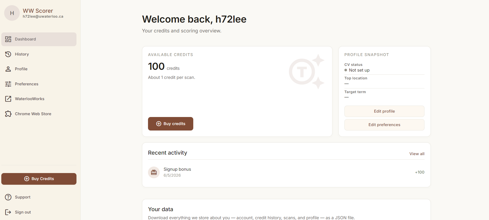
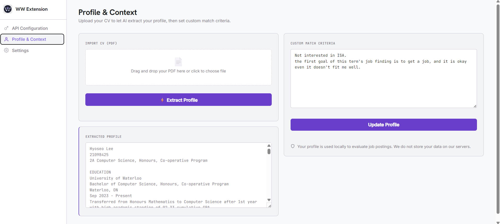
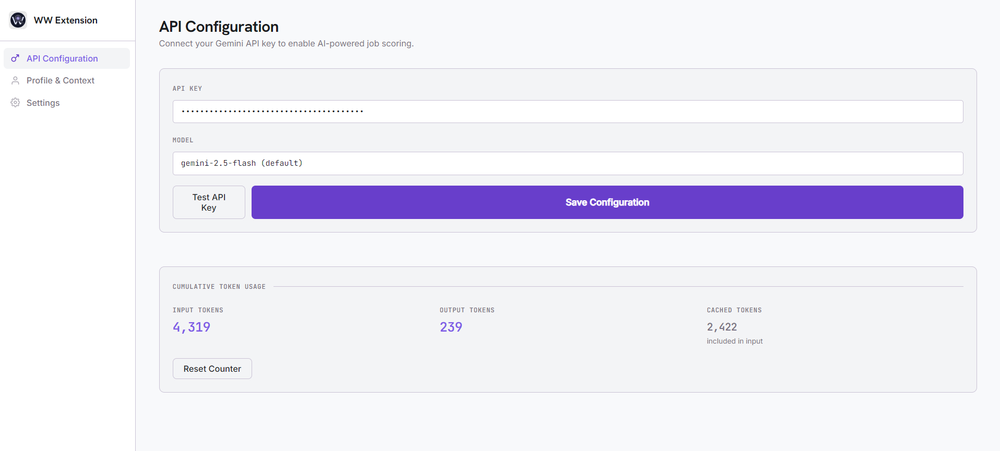

<div align="center">


# WW Extension

**AI-powered job scorer for WaterlooWorks**

Score every co-op posting against your profile in seconds. See which jobs are worth applying to without reading 200 descriptions.

<sub>Chrome · Manifest V3 · Google Gemini</sub>

[**▶ Install from the Chrome Web Store**](https://chromewebstore.google.com/detail/ww-extension/bichfckekdcnmkenflpmmehegggcfgdd) · [Web app](https://ww-extension.hyoseo.dev)

<sub><i>Not affiliated with the University of Waterloo or WaterlooWorks.</i></sub>

</div>

---



[▶ Full walkthrough on YouTube](https://www.youtube.com/watch?v=YURcZTqKS5U)



## What it does

WaterlooWorks dumps hundreds of postings on you each cycle. This extension reads each posting, compares it against your profile and match criteria using Google Gemini, and gives you a verdict:

- **Score 1–20** — how well the job fits you
- **Verdict** — `Strong Apply`, `Apply`, `Consider`, `Unlikely`, `Skip`, or `Excluded` (a hard requirement, like citizenship, rules you out)
- **Breakdown** — the specific points that most moved the score, each marked as a plus or a minus

Scores appear as inline badges directly in the WaterlooWorks job table and persist across navigation, so you can come back later and pick up where you left off.

## How it works

Scoring runs on a hosted backend, not in your browser — so there's no API key to manage and nothing to configure.

1. **Sign in** with your UWaterloo account (Microsoft) from the extension or the [web app](https://ww-extension.hyoseo.dev). New accounts get **100 free credits**.
2. **Set up your profile** on the web app: upload your WaterlooWorks application-package PDF and Gemini extracts a structured profile; add weighted match criteria (preferred locations, work modes, target term, languages, work authorization, and things to avoid or exclude).
3. **Scan** from the WaterlooWorks jobs list. Each posting scored costs roughly one credit against your balance; top up any time.

## Features

|                       |                                                                                                              |
| --------------------- | ------------------------------------------------------------------------------------------------------------ |
| **Bulk scan**         | One click scores every posting in your current search and injects badges into the table as results come in.  |
| **Ranked sidebar**    | A sortable, filterable list of all scored jobs. Click any entry to jump straight to its row.                 |
| **Profile extraction**| Drop your application-package PDF into the web app — Gemini extracts a structured profile you can edit.       |
| **Weighted criteria** | Graded match rules with `must` / `strong` / `nice-to-have` weights and preferred / acceptable / avoid / excluded tiers. |
| **Hard-filter skip**  | Postings that match something you marked **Never** are flagged `Excluded` and skipped without spending a credit. |
| **Bulk save**         | Filter by score threshold + verdict, then push matching jobs into a WaterlooWorks folder in one shot.        |
| **Credit balance**    | A simple credit meter — 100 free to start, Stripe top-ups on the web app, full ledger in your billing history. |
| **Light + dark**      | Theme follows your preference across the extension and the web app.                                          |

## Screenshots

<table>
<tr>
<td width="50%"><b>Web dashboard — account &amp; credits</b><br/></td>
<td width="50%"><b>Profile &amp; criteria setup</b><br/></td>
</tr>
<tr>
<td width="50%"><b>Extension — sign-in &amp; settings</b><br/></td>
<td width="50%"><b>Sidebar — ranked results</b><br/></td>
</tr>
</table>

## Install

The easiest path is the [Chrome Web Store](https://chromewebstore.google.com/detail/ww-extension/bichfckekdcnmkenflpmmehegggcfgdd).

To run from source in developer mode:

```bash
git clone https://github.com/hyoseo837/ww-extension.git
```

1. Open `chrome://extensions`
2. Enable **Developer mode** (top-right toggle)
3. Click **Load unpacked** and select the **`ext/`** folder inside the cloned repo
4. The extension icon will appear in your toolbar

## Usage

1. Click the extension icon and **sign in** with your UWaterloo account, then set up your profile on the [web app](https://ww-extension.hyoseo.dev).
2. Open `waterlooworks.uwaterloo.ca/myAccount/co-op/full/jobs.htm` and run a job search.
3. Click the **AI Score** tab on the right edge to open the sidebar, then hit **Scan All Jobs**. Badges appear on table rows as each posting finishes scoring.
4. Filter the sidebar by minimum score and verdict, then click **Save to Folder** to bulk-add matches to a WaterlooWorks folder.

## Privacy

This is an account-based service. When you sign in, we receive your `@uwaterloo.ca` email. Your profile (extracted CV text, preferences, and match criteria) is stored on the backend, tied to your account.

Each scoring call sends to Google Gemini:

- your profile and match criteria
- the job's title, organization, and description excerpt (capped at 6,000 characters)

Scores, credit balance, and billing records are kept server-side. You can review, export, or delete your data from the web app at any time.

Full policy: <https://ww-extension.hyoseo.dev/privacy> · Terms: <https://ww-extension.hyoseo.dev/terms>

## Architecture

A monorepo with three parts:

```
ext/      Chrome MV3 extension — plain JS, no build step (load this folder unpacked)
web/      Vite + React app — account, profile, billing, admin (ww-extension.hyoseo.dev)
server/   FastAPI backend — Gemini scoring, accounts, credits (Supabase + Stripe)
docs/     Specs, ADRs, and reference docs
```

Inside the extension:

```
ext/
├── manifest.json         Manifest V3 config
├── options.html          Options page (sign-in, theme, hard-filter toggle)
└── src/
    ├── content.js        Sidebar UI, table badge injection, pagination
    ├── background.js     Talks to the backend (service worker), session refresh
    ├── page-bridge.js    Injected page script — extracts WW auth tokens,
    │                     fetches posting HTML with the page's session cookies
    ├── options.js        Options page logic (sign-in, settings)
    └── sidebar.css       Sidebar + badge styles
```

**Why a page bridge?** WaterlooWorks gates posting-detail requests behind dynamic CSRF-style tokens embedded in the page. The bridge runs in the page's JS context so it can read those tokens and reuse the user's session cookies — the content script alone can't.

## Feedback

Bugs and suggestions: [GitHub Issues](https://github.com/hyoseo837/ww-extension/issues).

## License

Personal project — no license attached. Fork at your own risk.
